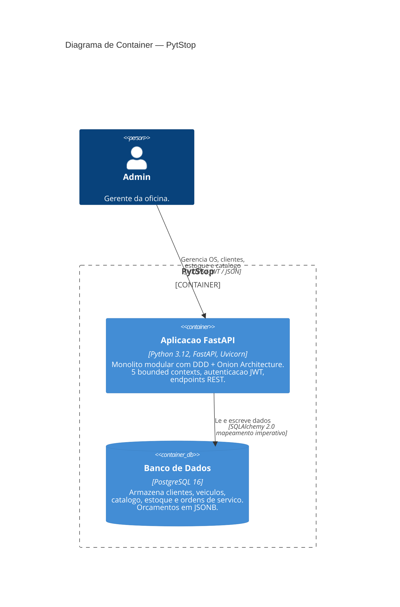

# C4 — Diagrama de Container (Level 2)

> **Status**: DRAFT — documento em elaboracao, sujeito a revisao pela equipe PytStop.

Mostra os containers que compõem o PytStop e como se comunicam. Baseado no modelo C4 de Simon Brown (Software Architecture — Aula 2).

## Diagrama

## Containers

| Container | Tecnologia | Responsabilidade |
|---|---|---|
| Aplicacao FastAPI | Python 3.12, FastAPI, Uvicorn | Monolito modular. Expõe endpoints REST, aplica autenticacao JWT, orquestra os 5 bounded contexts via Onion Architecture. |
| Banco de Dados | PostgreSQL 16 | Persistencia de todos os contextos. Orcamentos em JSONB; bloqueio pessimista via `SELECT FOR UPDATE NOWAIT`. |

## Swagger UI

O Swagger UI e gerado automaticamente pelo FastAPI e configurado por ambiente:

- **Producao**: desabilitado (RNF-007)
- **Desenvolvimento/staging**: habilitado com autenticacao JWT ([ADR-004](../adr/004-autenticacao-jwt.md))

## Comunicacao

Toda comunicacao e sincrona — sem filas nem message brokers no MVP.

## Rastreabilidade

- Arquitetura Onion: [ADR-003](../adr/003-arquitetura-ddd-onion.md)
- Autenticacao JWT: [ADR-004](../adr/004-autenticacao-jwt.md)
- Mapeamento imperativo: [ADR-006](../adr/006-mapeamento-imperativo-sqlalchemy.md)
- Bloqueio pessimista estoque: [ADR-008](../adr/008-bloqueio-pessimista-estoque.md)
- Orcamento JSONB: [RFC-001 §5](../rfc/rfc-001-design-do-sistema.md)
- Stack tecnologica: [RFC-001](../rfc/rfc-001-design-do-sistema.md)
