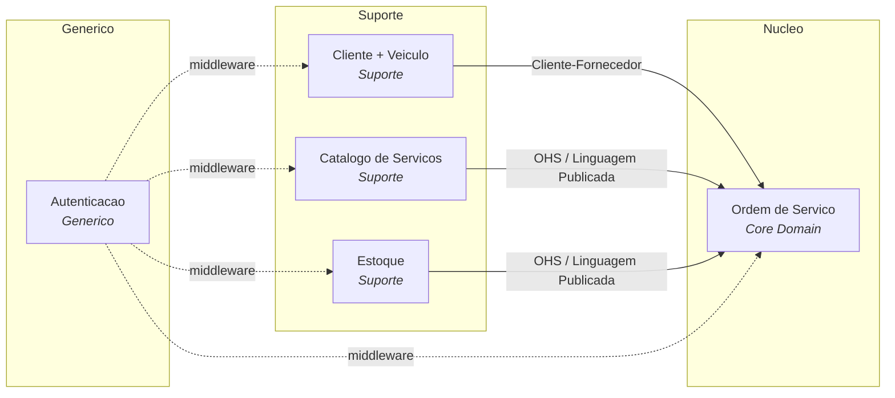
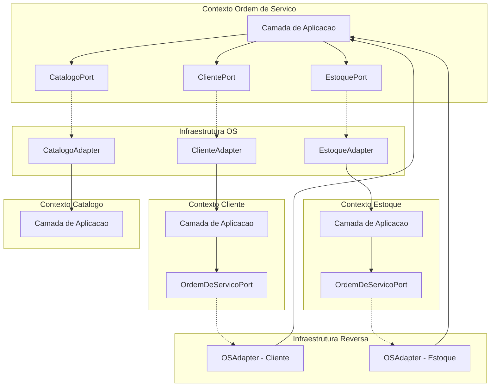

# Mapa de Contextos

Representação dos 5 contextos delimitados e seus padrões de integração, conforme definido no [ADR-007](adr/007-organizacao-contextos-delimitados.md).

## Diagrama

> Direção das setas: fornecedor → consumidor (upstream → downstream).

## Contextos Delimitados

| Contexto | Classificação | Agregados | Responsabilidade |
|---|---|---|---|
| **Ordem de Serviço** | Core | `OrdemDeServico` | Ciclo de vida da OS (7 status), geração de orçamento, orquestração cross-contexto |
| **Cliente + Veículo** | Suporte | `Cliente`, `Veiculo` | Cadastro e validação de clientes (CPF/CNPJ) e seus veículos |
| **Catálogo de Serviços** | Suporte | `ServicoOferecido` | Tipos de serviço disponíveis com preços |
| **Estoque** | Suporte | `ItemEstoque` | Peças e insumos com reserva pessimista e controle de quantidade |
| **Autenticação** | Genérico | `Usuario` | JWT, credenciais, RBAC. Substituível por Auth0/Keycloak. |

## Padrões de Integração

### Cliente-Fornecedor (Customer-Supplier)

**Fornecedor**: Cliente + Veículo
**Consumidor**: Ordem de Serviço

O contexto Cliente fornece dados para a criação de OS. A porta `ClientePort` (definida pelo consumidor) expõe:
- `cliente_existe(cliente_id) -> bool`
- `veiculo_existe(veiculo_id) -> bool`
- `obter_veiculo_por_placa_e_documento(placa, documento) -> tuple[UUID, UUID] | None`

Operações de leitura — não recebem `UnitOfWork`.

### Open Host Service (OHS) / Linguagem Publicada

**Fornecedores**: Catálogo de Serviços, Estoque
**Consumidor**: Ordem de Serviço

Catálogo expõe serviços via `CatalogoPort`:
- `obter_servico(servico_id) -> ServicoOferecidoDTO | None`

Estoque expõe reserva/liberação via `EstoquePort`:
- `reservar(itens, udt) -> None` — recebe `UnitOfWork` para atomicidade
- `liberar(itens, udt) -> None` — recebe `UnitOfWork` para atomicidade

A Linguagem Publicada é o `ServicoOferecidoDTO` — tipo compartilhado que desacopla os contextos.

### Consulta Reversa (Downstream → Upstream)

Os contextos Cliente e Estoque precisam verificar se existem OS ativas antes de permitir exclusão (RN-009, RN-011). Como a direção principal de dependência é OS → Suporte, uma porta reversa é necessária.

A porta `OrdemDeServicoPort` é definida pelos contextos consumidores (Cliente, Estoque) na sua camada de aplicação:
- `existe_os_ativa_para_cliente(cliente_id) -> bool` — usada por Cliente (RN-009)
- `existe_os_ativa_para_veiculo(veiculo_id) -> bool` — usada por Cliente (exclusão de veículo)
- `existe_os_ativa_com_item_estoque(item_estoque_id) -> bool` — usada por Estoque (RN-011)

Operações de leitura — não recebem `UnitOfWork`. O adaptador vive na infraestrutura do contexto consumidor e consulta o repositório de OS.

> **Trade-off**: essa porta reversa cria uma dependência cíclica no nível de infraestrutura (adapters). No monolito MVP, isso é aceitável — os contextos de domínio permanecem desacoplados. Em evolução para microsserviços, essa consulta seria substituída por eventos de domínio ou eventual consistency.

### Middleware (Cross-Cutting)

Autenticação é infraestrutura transversal via `Depends()` do FastAPI. Não é comunicação entre contextos de domínio — é enforcement de segurança na camada de interfaces.

## Comunicação

Toda comunicação é in-process via portas e adaptadores. Adaptadores vivem na camada de infraestrutura. A raiz de composição (`main.py`) faz o wiring de DI — único ponto que importa implementações concretas.

## Código Compartilhado

`compartilhado/dominio/` contém:
- Classes base: `Entity`, `AggregateRoot`, `ValueObject`, `DomainEvent`
- Objeto de valor `Dinheiro` (usado por vários contextos)
- Hierarquia de exceções: `DomainException` e subclasses

Não é um Shared Kernel — é código utilitário sem regras de negócio específicas de um contexto.
