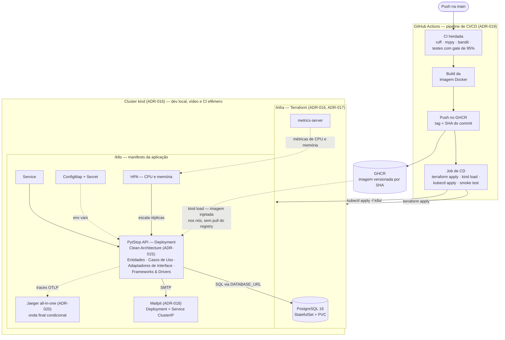

# Documento de Entrega — Tech Challenge Fase 2

> [↑ Raiz do projeto](https://github.com/fiap-postech-sw-architecture/postech-sw-arch-p2) · [↑ Entrega Fase 2](https://github.com/fiap-postech-sw-architecture/postech-sw-arch-p2/tree/main/docs/entrega/fase2)

> **Versão**: 1.2 — Junho/2026.

Documento de entrega da Fase 2 do Tech Challenge da Pós-Graduação em Arquitetura de Software (FIAP). O conteúdo cobre os itens exigidos pelo enunciado da fase: identificação do grupo, link do repositório (compartilhado com o avaliador), desenho da arquitetura, instruções de execução e deploy, link da collection das APIs e link do vídeo de demonstração.

## Como ler este documento

O repositório é a fonte de verdade da entrega. Os artefatos exigidos pela fase — código refatorado com Clean Architecture, Dockerfile e docker-compose revisados, manifests Kubernetes em `/k8s`, scripts Terraform em `/infra`, pipeline de CI/CD e README atualizado — estão versionados no próprio projeto. Os links abaixo apontam diretamente para esses arquivos no GitHub (branch `main`), navegáveis pela UI nativa do GitHub com o avaliador adicionado como colaborador. O desenho da arquitetura é modelado em Mermaid, renderizado nativamente pelo GitHub; a fonte única do diagrama é a [RFC-002 §3](https://github.com/fiap-postech-sw-architecture/postech-sw-arch-p2/blob/main/docs/arquitetura/rfc/fase2/rfc-002-infraestrutura-e-deploy-fase-2.md), replicada no [README](https://github.com/fiap-postech-sw-architecture/postech-sw-arch-p2/blob/main/README.md) e na seção 6 deste documento.

A opção por documentação textual e versionada segue a fase 1: o projeto é AI-first, e Markdown + Mermaid permitem manutenção por agentes de IA sem prejuízo da leitura humana. As decisões da fase estão registradas em ADRs (015–021) e consolidadas na RFC-002; a rastreabilidade requisito → implementação → evidência está na seção 5.

---

## 1. Identificação do Grupo

| Campo | Valor |
|---|---|
| Nome do grupo | PytStop |
| Turma | 15SOAT — Pós-Graduação em Arquitetura de Software (FIAP) |

### Participantes

| Nome | RM | Discord |
|---|---|---|
| João Amaral | RM373448 | joao_13997 |
| Allan Aurélio | RM372116 | all66_ |
| Carlos Silva | RM374191 | carlossilva156 |
| Guilherme Sousa | RM373609 | romen0 |
| Nicolas Gerbi | RM372644 | sethiiz_gerbi |

## 2. Link do Repositório

Repositório privado no GitHub, compartilhado com `soat-architecture` conforme exigido pelo enunciado. A fase 2 continua no mesmo histórico da fase 1: o repositório incorpora os 118 commits do MVP ([PR #11](https://github.com/fiap-postech-sw-architecture/postech-sw-arch-p2/pull/11)) e evolui a partir deles.

| Recurso | URL |
|---|---|
| Repositório | https://github.com/fiap-postech-sw-architecture/postech-sw-arch-p2 |
| README (arquitetura, execução local, deploy K8s, Terraform) | https://github.com/fiap-postech-sw-architecture/postech-sw-arch-p2/blob/main/README.md |
| Dockerfile | https://github.com/fiap-postech-sw-architecture/postech-sw-arch-p2/blob/main/Dockerfile |
| docker-compose.yml | https://github.com/fiap-postech-sw-architecture/postech-sw-arch-p2/blob/main/docker-compose.yml |
| Manifests Kubernetes (`/k8s`) | https://github.com/fiap-postech-sw-architecture/postech-sw-arch-p2/tree/main/k8s |
| Scripts Terraform (`/infra`) | https://github.com/fiap-postech-sw-architecture/postech-sw-arch-p2/tree/main/infra |
| Pipeline de CI (herdada da fase 1) | https://github.com/fiap-postech-sw-architecture/postech-sw-arch-p2/blob/main/.github/workflows/ci.yml |
| Pipeline de CD (build de imagem + deploy + smoke test) | https://github.com/fiap-postech-sw-architecture/postech-sw-arch-p2/blob/main/.github/workflows/cd.yml |
| Collection das APIs (Postman, gerada do OpenAPI) | https://github.com/fiap-postech-sw-architecture/postech-sw-arch-p2/blob/main/docs/entrega/fase2/postman_collection.json |

A collection foi gerada a partir do contrato OpenAPI vivo da aplicação (46 requisições agrupadas por tag); o Swagger UI em `/docs` permanece a referência interativa — instruções de acesso no README.

### Execuções verdes do CD na main

O pipeline de CD provisiona um cluster kind efêmero no runner (Terraform), publica a imagem no GHCR com tag imutável por SHA e aplica os manifests com smoke test ao final ([ADR-019](https://github.com/fiap-postech-sw-architecture/postech-sw-arch-p2/blob/main/docs/arquitetura/adr/fase2/019-pipeline-cicd-deploy.md)):

| Execução | Conteúdo | URL |
|---|---|---|
| Run 27450493913 | Primeiro deploy completo (merge do [PR #21](https://github.com/fiap-postech-sw-architecture/postech-sw-arch-p2/pull/21)) | https://github.com/fiap-postech-sw-architecture/postech-sw-arch-p2/actions/runs/27450493913 |
| Run 27451618014 | Deploy com OpenTelemetry/Jaeger (merge do [PR #22](https://github.com/fiap-postech-sw-architecture/postech-sw-arch-p2/pull/22)) | https://github.com/fiap-postech-sw-architecture/postech-sw-arch-p2/actions/runs/27451618014 |

## 3. Link do Vídeo

Vídeo de até 15 minutos demonstrando deploy, execução do CI/CD, consumo das APIs e escalabilidade automática, conforme o enunciado. Roteiro de gravação: [roteiro-video.md](https://github.com/fiap-postech-sw-architecture/postech-sw-arch-p2/blob/main/docs/entrega/fase2/roteiro-video.md).

| Recurso | URL |
|---|---|
| Vídeo de demonstração | _link será adicionado após a gravação_ <!-- VIDEO-LINK-FASE-2 --> |

## 4. Link da Documentação

Toda a documentação versionada está no próprio repositório, na pasta `docs/`.

### 4.1 Índice geral

| Recurso | URL |
|---|---|
| Pasta `docs/` (índice) | https://github.com/fiap-postech-sw-architecture/postech-sw-arch-p2/tree/main/docs |
| Requisitos da fase 2 (enunciado transcrito) | https://github.com/fiap-postech-sw-architecture/postech-sw-arch-p2/blob/main/docs/requisitos/fase2/desafio-tech-fase-2.md |
| Gap analysis — challenge × código da fase 1 (RF-020–024, RNF-017–024, RN-018–020) | https://github.com/fiap-postech-sw-architecture/postech-sw-arch-p2/blob/main/docs/requisitos/fase2/gap-analysis-fase-2.md |

### 4.2 Decisões de arquitetura da fase 2

| Artefato | Decisão | URL |
|---|---|---|
| RFC-002 | Infraestrutura e deploy da fase 2 — desenho integrado e diagrama de referência | https://github.com/fiap-postech-sw-architecture/postech-sw-arch-p2/blob/main/docs/arquitetura/rfc/fase2/rfc-002-infraestrutura-e-deploy-fase-2.md |
| ADR-015 | Clean Architecture como arquitetura alvo (sem rewrite) | https://github.com/fiap-postech-sw-architecture/postech-sw-arch-p2/blob/main/docs/arquitetura/adr/fase2/015-arquitetura-alvo-fase-2.md |
| ADR-016 | kind como plataforma Kubernetes (dev, vídeo e CI) | https://github.com/fiap-postech-sw-architecture/postech-sw-arch-p2/blob/main/docs/arquitetura/adr/fase2/016-plataforma-kubernetes.md |
| ADR-017 | PostgreSQL como StatefulSet provisionado pelo Terraform | https://github.com/fiap-postech-sw-architecture/postech-sw-arch-p2/blob/main/docs/arquitetura/adr/fase2/017-provisionamento-banco.md |
| ADR-018 | Notificação de status por e-mail via adapter SMTP com Mailpit | https://github.com/fiap-postech-sw-architecture/postech-sw-arch-p2/blob/main/docs/arquitetura/adr/fase2/018-notificacao-email.md |
| ADR-019 | Pipeline de CI/CD com deploy em cluster kind efêmero no runner | https://github.com/fiap-postech-sw-architecture/postech-sw-arch-p2/blob/main/docs/arquitetura/adr/fase2/019-pipeline-cicd-deploy.md |
| ADR-020 | Observabilidade com OpenTelemetry e Jaeger em escopo mínimo | https://github.com/fiap-postech-sw-architecture/postech-sw-arch-p2/blob/main/docs/arquitetura/adr/fase2/020-observabilidade-opentelemetry.md |
| ADR-021 | Aprovação e recusa externas de orçamento via token dedicado | https://github.com/fiap-postech-sw-architecture/postech-sw-arch-p2/blob/main/docs/arquitetura/adr/fase2/021-aprovacao-externa-orcamento.md |

A documentação da fase 1 (Event Storming, Domain Storytelling, Linguagem Ubíqua, mapa de contextos, modelo de domínio, ADRs 001–014) permanece válida e versionada nas mesmas pastas — índice em [`docs/`](https://github.com/fiap-postech-sw-architecture/postech-sw-arch-p2/tree/main/docs).

## 5. Rastreabilidade requisito → evidência

Cada requisito da fase 2 ([gap analysis](https://github.com/fiap-postech-sw-architecture/postech-sw-arch-p2/blob/main/docs/requisitos/fase2/gap-analysis-fase-2.md)) mapeado para o PR que o implementou, a evidência principal no código e o ponto do [roteiro do vídeo](https://github.com/fiap-postech-sw-architecture/postech-sw-arch-p2/blob/main/docs/entrega/fase2/roteiro-video.md) que o demonstra.

### Requisitos funcionais

| ID | Requisito | PR | Evidência (arquivo / teste chave) | Demonstração no vídeo |
|---|---|---|---|---|
| RF-020 | Abertura de OS com cliente, veículo, serviços e peças, retornando id único | [#15](https://github.com/fiap-postech-sw-architecture/postech-sw-arch-p2/pull/15) | `CriarOrdemDTO` com `servicos`/`pecas` e montagem única de itens em `src/ordem_servico/aplicacao/use_cases.py`; e2e `tests/integracao/test_api_e2e.py::TestCriacaoOsComItens` | Bloco 4 — `POST /ordens-de-servico/` com itens → 201 + `id` |
| RF-021 | Consulta de status no vocabulário do challenge | [#14](https://github.com/fiap-postech-sw-architecture/postech-sw-arch-p2/pull/14) | `situacao_de` em `src/ordem_servico/aplicacao/situacoes.py` + campo `situacao` nos 3 schemas de resposta; `tests/unitarios/ordem_servico/test_presenters.py` | Bloco 4 — `GET /ordens-de-servico/{id}` e acompanhamento público com `situacao` |
| RF-022 | Endpoint externo de aprovação/recusa de orçamento | [#16](https://github.com/fiap-postech-sw-architecture/postech-sw-arch-p2/pull/16) | Rota `POST /publico/ordens-de-servico/{id}/decisao-orcamento` em `src/compartilhado/interfaces/router_publico.py`; use case `DecidirOrcamento`; [ADR-021](https://github.com/fiap-postech-sw-architecture/postech-sw-arch-p2/blob/main/docs/arquitetura/adr/fase2/021-aprovacao-externa-orcamento.md) | Bloco 4 — aprovar e recusar com header `X-Webhook-Token` |
| RF-023 | Listagem ordenada por prioridade de status, sem encerradas (exclusão lógica) | [#13](https://github.com/fiap-postech-sw-architecture/postech-sw-arch-p2/pull/13) | `_PRIORIDADE_STATUS`/`_ESTADOS_ENCERRADOS` + parâmetro `incluir_encerradas` em `src/ordem_servico/infraestrutura/repository.py`; teste-guarda em `tests/unitarios/ordem_servico/test_repository_os.py` | Bloco 4 — listagem com OS em status distintos |
| RF-024 | Notificação de atualização de status por e-mail | [#17](https://github.com/fiap-postech-sw-architecture/postech-sw-arch-p2/pull/17) | `EventDispatcher` em `src/ordem_servico/aplicacao/dispatcher.py` + handler de e-mail em `aplicacao/notificacoes.py` + adapter SMTP em `infraestrutura/`; `tests/unitarios/ordem_servico/test_notificacoes.py` | Bloco 4 — e-mail materializado na UI do Mailpit |

### Requisitos não funcionais

| ID | Requisito | PR | Evidência (arquivo / teste chave) | Demonstração no vídeo |
|---|---|---|---|---|
| RNF-017 | Clean Architecture formalizada e verificada | [#12](https://github.com/fiap-postech-sw-architecture/postech-sw-arch-p2/pull/12) | Contratos de camadas em `[tool.importlinter]` (`pyproject.toml`), verificados por `make lint-arch` na CI; [ADR-015](https://github.com/fiap-postech-sw-architecture/postech-sw-arch-p2/blob/main/docs/arquitetura/adr/fase2/015-arquitetura-alvo-fase-2.md) | Bloco 1 (diagrama) + encerramento |
| RNF-018 | Testes dos fluxos críticos mantidos na evolução | [#13](https://github.com/fiap-postech-sw-architecture/postech-sw-arch-p2/pull/13)–[#17](https://github.com/fiap-postech-sw-architecture/postech-sw-arch-p2/pull/17) (transversal) | Gate de 95% em `.coveragerc`; cobertura de 97,52% na CI da main ([run 27451618008](https://github.com/fiap-postech-sw-architecture/postech-sw-arch-p2/actions/runs/27451618008)) | Encerramento |
| RNF-019 | Dockerfile e docker-compose revisados (healthcheck do app) | [#18](https://github.com/fiap-postech-sw-architecture/postech-sw-arch-p2/pull/18) | `HEALTHCHECK` no `Dockerfile` + bloco `healthcheck` do serviço `app` no `docker-compose.yml`, ambos probando `/api/v1/saude` | Bloco 2 — paridade local × cluster |
| RNF-020 | Manifests K8s: Deployment, Service, ConfigMap, Secret, HPA | [#19](https://github.com/fiap-postech-sw-architecture/postech-sw-arch-p2/pull/19) | [`k8s/`](https://github.com/fiap-postech-sw-architecture/postech-sw-arch-p2/tree/main/k8s) — `deployment.yaml`, `service.yaml`, `configmap.yaml`, `secret.yaml`, `hpa.yaml`, `mailpit.yaml`, `jaeger.yaml` | Blocos 2 e 5 |
| RNF-021 | IaC: Terraform provisiona cluster e banco, documentado | [#20](https://github.com/fiap-postech-sw-architecture/postech-sw-arch-p2/pull/20) | [`infra/`](https://github.com/fiap-postech-sw-architecture/postech-sw-arch-p2/tree/main/infra) — cluster kind + namespace + Secret + StatefulSet PostgreSQL + Service num único apply; recursos documentados em `infra/README.md` | Bloco 2 — `terraform apply` dentro do `make cd-local` |
| RNF-022 | CI/CD: build, testes, imagem, deploy de banco e app, manifests | [#21](https://github.com/fiap-postech-sw-architecture/postech-sw-arch-p2/pull/21) | [`.github/workflows/cd.yml`](https://github.com/fiap-postech-sw-architecture/postech-sw-arch-p2/blob/main/.github/workflows/cd.yml) + alvos `make k8s-up`/`k8s-smoke`/`cd-local` espelhando o workflow | Bloco 3 — runs verdes 27450493913 e 27451618014 |
| RNF-023 | HPA-readiness: probes e resources no Deployment | [#19](https://github.com/fiap-postech-sw-architecture/postech-sw-arch-p2/pull/19) | Liveness/readiness em `/api/v1/saude` + requests/limits em `k8s/deployment.yaml`; metrics-server instalado pelo fluxo de deploy | Bloco 5 — HPA reagindo à carga |
| RNF-024 | Statelessness para escala horizontal | [#19](https://github.com/fiap-postech-sw-architecture/postech-sw-arch-p2/pull/19) (parcial por desenho) | JWT stateless com denylist no PostgreSQL (fase 1); `ENCRYPTION_KEY` única e estável via `k8s/secret.yaml`; rate limit por réplica aceito e documentado em `k8s/README.md` | Bloco 5 — N réplicas atendendo a mesma carga |

### Regras de negócio

| ID | Regra | PR | Evidência (arquivo / teste chave) | Demonstração no vídeo |
|---|---|---|---|---|
| RN-018 | Prioridade Em execução > Aguardando aprovação > Em diagnóstico > Recebida; mais antigas primeiro, desempate por id | [#13](https://github.com/fiap-postech-sw-architecture/postech-sw-arch-p2/pull/13) | `CASE` de prioridade + `criado_em ASC, id` em `src/ordem_servico/infraestrutura/repository.py` | Bloco 4 — ordem visível na listagem |
| RN-019 | Exclusão lógica de `FINALIZADA`/`ENTREGUE` (nenhum delete físico) | [#13](https://github.com/fiap-postech-sw-architecture/postech-sw-arch-p2/pull/13) | Filtro de consulta `notin_(_ESTADOS_ENCERRADOS)`; `incluir_encerradas=true` prova que as linhas permanecem | Bloco 4 — listagem com e sem `incluir_encerradas` |
| RN-020 | Status extras: complementar ordena com Aguardando aprovação; `CANCELADA` excluída como encerrada | [#13](https://github.com/fiap-postech-sw-architecture/postech-sw-arch-p2/pull/13) (ratificada no [ADR-021](https://github.com/fiap-postech-sw-architecture/postech-sw-arch-p2/blob/main/docs/arquitetura/adr/fase2/021-aprovacao-externa-orcamento.md)) | Teste-guarda de totalidade dos 8 estados em `tests/unitarios/ordem_servico/test_repository_os.py` | Bloco 4 — implícito na listagem |

**Além dos requisitos**: observabilidade mínima com OpenTelemetry + Jaeger — traces de FastAPI e SQLAlchemy no cluster de demo ([ADR-020](https://github.com/fiap-postech-sw-architecture/postech-sw-arch-p2/blob/main/docs/arquitetura/adr/fase2/020-observabilidade-opentelemetry.md), [PR #22](https://github.com/fiap-postech-sw-architecture/postech-sw-arch-p2/pull/22)); demonstrada no bloco 6 do vídeo.

### Qualidade além do escopo — dívida técnica endereçada

O backlog de dívida técnica é mantido como um ledger versionado em [`docs/tech-debt/README.md`](https://github.com/fiap-postech-sw-architecture/postech-sw-arch-p2/blob/main/docs/tech-debt/README.md), com itens classificados e rastreados desde a fase 1. Fora do escopo exigido pela fase 2, o grupo amortizou parte desse backlog — incluindo um débito tático de DDD herdado da fase 1 — e manteve o ledger fiel ao código:

| Item | O que foi feito | PR |
|---|---|---|
| TD-009 (DDD tático — fase 1) | Emissão dos eventos de criação que faltavam no event storming, `ClienteCadastrado` e `ServicoCadastrado`, via factory `criar()` nos agregados, com payload sem PII e teste de regressão | [#48](https://github.com/fiap-postech-sw-architecture/postech-sw-arch-p2/pull/48) |
| Reconciliação do ledger | Auditoria item a item de `tech-debt/README.md` contra o código: TD-003 (CSP) e TD-017 (PII no OpenTelemetry) marcados como resolvidos (já implementados) e TD-002/004/005/008/016 corrigidos para refletir o estado real | [#47](https://github.com/fiap-postech-sw-architecture/postech-sw-arch-p2/pull/47) |
| TD-019 (Clean Architecture) | Extração de `PasswordHasherPort`/`JWTServicePort` na autenticação, removendo o último acoplamento `aplicação → infraestrutura`; o contrato `forbidden` do import-linter passou a verificá-lo globalmente em todos os contextos, reforçando a **RNF-017** | [#50](https://github.com/fiap-postech-sw-architecture/postech-sw-arch-p2/pull/50) |

Isso concretiza a Boy Scout Rule registrada na estratégia de pagamento do [ledger de dívida técnica](https://github.com/fiap-postech-sw-architecture/postech-sw-arch-p2/blob/main/docs/tech-debt/README.md): cada evolução deixa o código e a documentação melhores do que os encontrou. Nenhum desses itens era exigido pela fase 2 — são iniciativa de qualidade do grupo.

## 6. Desenho da arquitetura

Diagrama de referência da fase 2 — pipeline de deploy, infraestrutura provisionada e workloads no cluster. Fonte única: [RFC-002 §3](https://github.com/fiap-postech-sw-architecture/postech-sw-arch-p2/blob/main/docs/arquitetura/rfc/fase2/rfc-002-infraestrutura-e-deploy-fase-2.md); o GitHub renderiza o bloco abaixo nativamente.

<!-- fonte: RFC-002 §3 — manter em sincronia -->

## 7. Conteúdo do PDF de submissão

O PDF entregue no portal do aluno é gerado a partir deste documento e contém os três itens exigidos pelo enunciado:

1. **Link do repositório GitHub** compartilhado com o usuário `soat-architecture`: https://github.com/fiap-postech-sw-architecture/postech-sw-arch-p2
2. **Desenho da arquitetura** com os recursos escolhidos (seção 6 — kind, Terraform, GHCR, manifests K8s com HPA, Mailpit, Jaeger).
3. **Link do vídeo** de até 15 minutos apresentando a solução (seção 3 — preenchido após a gravação).

## 8. Pendências para fechar a entrega

Ações manuais que permanecem com a equipe (nenhuma bloqueia a navegação do repositório):

| # | Pendência | Onde |
|---|---|---|
| 1 | Confirmar/convidar `soat-architecture` como colaborador do repositório | GitHub → Settings → Collaborators |
| 2 | Gravar o vídeo seguindo o [roteiro](https://github.com/fiap-postech-sw-architecture/postech-sw-arch-p2/blob/main/docs/entrega/fase2/roteiro-video.md) e publicar (YouTube/Vimeo, não listado) | — |
| 3 | Preencher o link do vídeo na seção 3 deste documento e no README (marcadores `VIDEO-LINK-FASE-2`) | `docs/entrega/fase2/entrega-fase-2.md` + `README.md` |
| 4 | Regerar o PDF (`documento-entrega-fase-2.pdf`) com o link do vídeo preenchido e submeter no portal do aluno | fluxo descrito no [README da pasta](https://github.com/fiap-postech-sw-architecture/postech-sw-arch-p2/blob/main/docs/entrega/fase2/README.md) |

---

> [↑ Raiz do projeto](https://github.com/fiap-postech-sw-architecture/postech-sw-arch-p2) · [↑ Entrega Fase 2](https://github.com/fiap-postech-sw-architecture/postech-sw-arch-p2/tree/main/docs/entrega/fase2)
